```{r, include = FALSE}
knitr::opts_chunk$set(
  collapse = TRUE,
  comment = "#>"
)
```

This article contains many screenshots, by necessity.
However, there are many downsides to a screenshot-heavy article and the reader needs to be ready to adapt to certain issues:

* These webpages are outside of the control of gmailr and change over
  time.
* These webpages can look different depending on:
  - The type of Google account you are using, i.e. an individual
    versus a user within a Google workspace organization, such as a
    company or university.
  - Your previous use of Google Cloud.
  - Probably other factors!

The bottom line is that the screenshots you see here may not exactly match what you see.
We offer this assistance on a "best effort" basis, but you may need to be a bit resourceful and resilient.
There may be differences between the screenshots here and what you see.

## Sign in to Google Cloud console

Go to the [Google Cloud console](https://cloud.google.com/cloud-console) and sign in:

<https://console.cloud.google.com/>

```{r}
#| echo: false
#| label: fig-sign-in
#| out.width: 600px
#| fig-cap: >
#|   Sign in to Google Cloud console.
#| fig-alt: >
#|   The sign in page for Google Cloud Platform.
#|   The Email or phone box is selected and ready for user input.
#|   In the lower left is a "Next" button to move to next step of sign in.
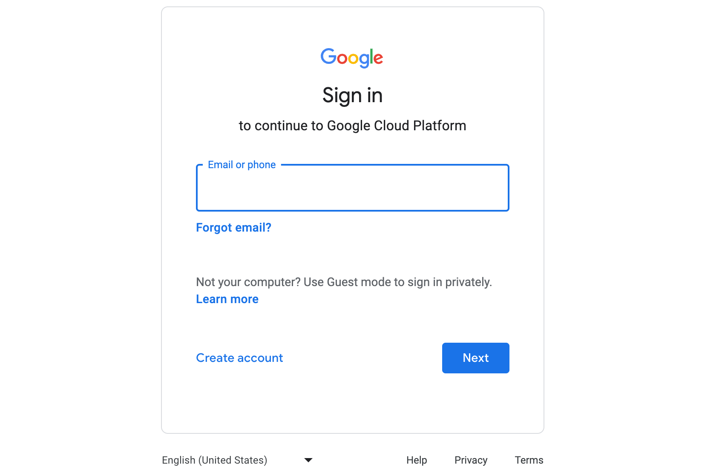
```

## New user of Google Cloud, new project

I focus on the user who has never used Google Cloud before and who is authenticating as an individual (versus as a user within an organization).
The rationale is that these are the users who will benefit the most from this documentation.
I may eventually create documentation focused on a different type of user, but, in the meantime, hopefully other users can still gain something from this article.

If this is your first usage of Google Cloud, you need to agree to their Terms of Service.

```{r}
#| echo: false
#| label: fig-welcome-new-user
#| out.width: 600px
#| fig-cap: >
#|   Access Google Cloud Terms of Service.
#| fig-alt: >
#|   A new Google Cloud user checks a box to agree to the terms of service.
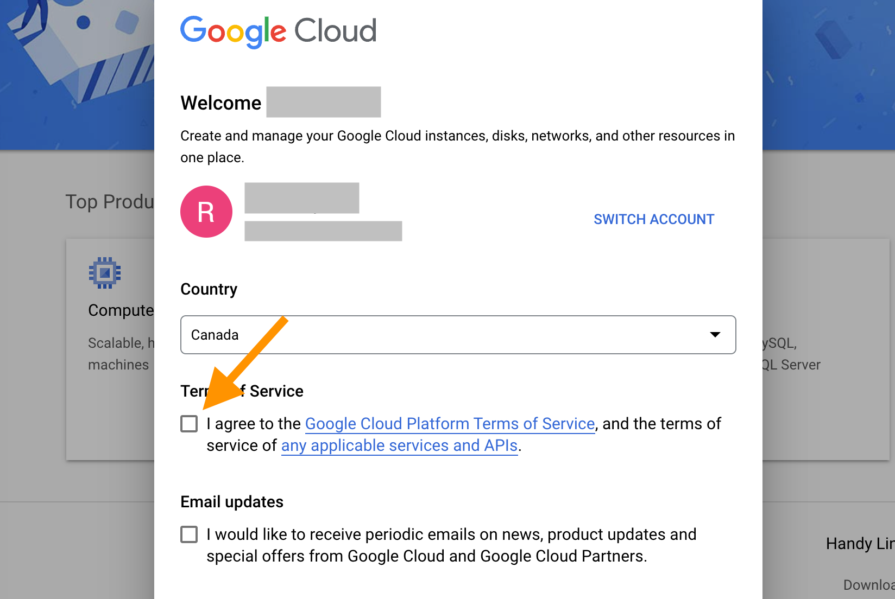
```

At this point, you might see an offer to start a free trial of Google Cloud Platform, but that is not necessary in order to create an OAuth client.
(You might be interested in the free trial if you want to experiment with Google Cloud services that normally cost money.
You can activate that or not; it has nothing to do with your ability to create an OAuth client that works with gmailr.)

Next we need to select a project.
Locate and click the "Select a project" button.

```{r}
#| echo: false
#| label: fig-select-a-project-new-user-1
#| out.width: 600px
#| fig-cap: >
#|   "Select a project" button.
#| fig-alt: >
#|   The "Select a project" button is in the upper left, next to "Google Cloud".
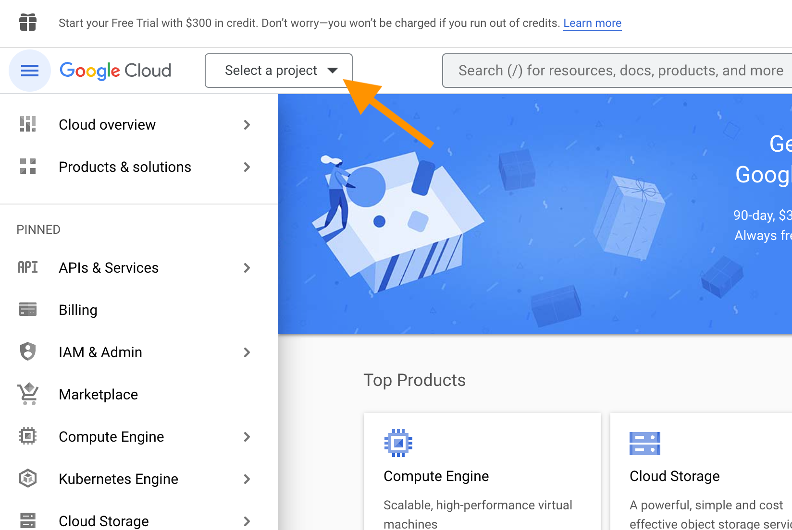
```

Since you are a new user, you presumably don't have any projects.
Click "NEW PROJECT" in the upper right corner.

```{r}
#| echo: false
#| label: fig-select-a-project-new-user-2
#| out.width: 600px
#| fig-cap: >
#|   In the "Select a project" pop-up.
#| fig-alt: >
#|   The "Select a project" pop-up is where we can select or create a project.
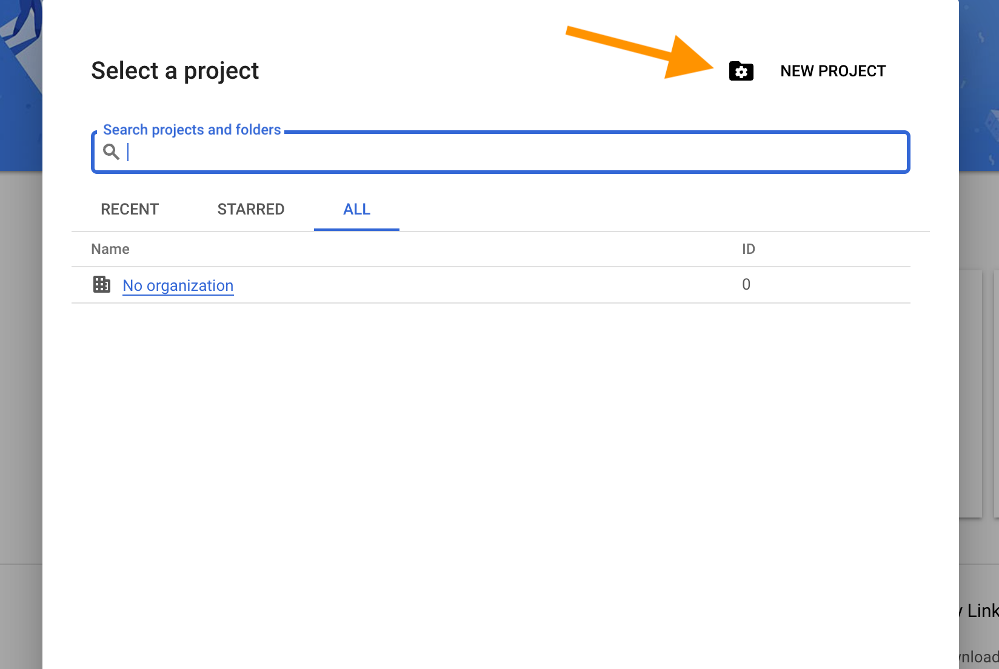
```

Now you are on the "New Project" screen.

```{r}
#| echo: false
#| label: new-project-new-user
#| out.width: 600px
#| fig-cap: >
#|   The "New Project" screen.
#| fig-alt: >
#|   The "New Project" screen has a box where we can enter the Project name.
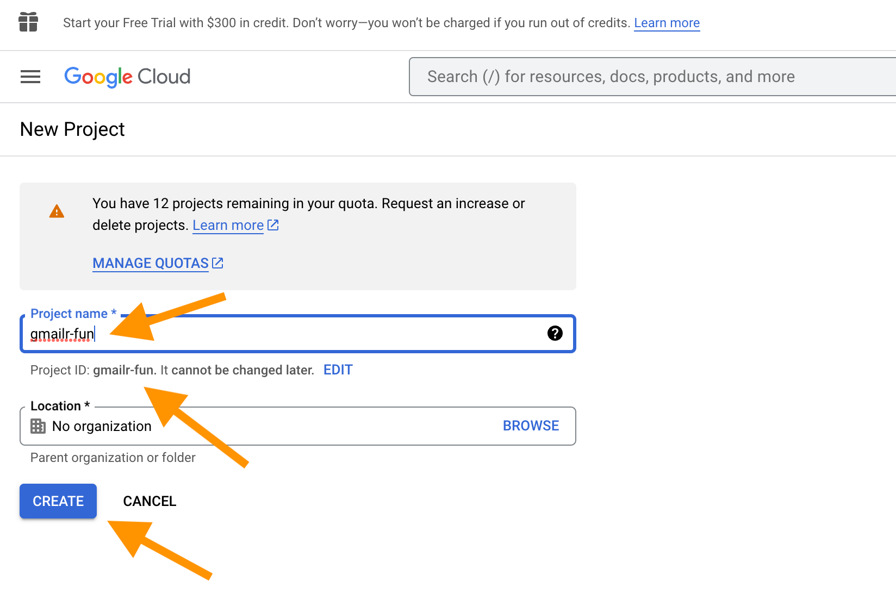
```

I strongly recommend that you **do not** accept the automatically generated project name.
Instead I recommend that you give the project some meaningful (or at least memorable) label that reminds you of its purpose and use that for both the project name and project ID.
When you are happy with the project name and ID, click the "CREATE" button.

Now you should see that you are working within your intended target project.

```{r}
#| echo: false
#| label: fig-select-a-project-new-user-3
#| out.width: 600px
#| fig-cap: >
#|   Another possible screen (using the gmailr-fun project as an example).
#| fig-alt: >
#|   The button that previously said "Select a project" for a new user now says
#|   "gmailr-fun", which is the name of the target project.
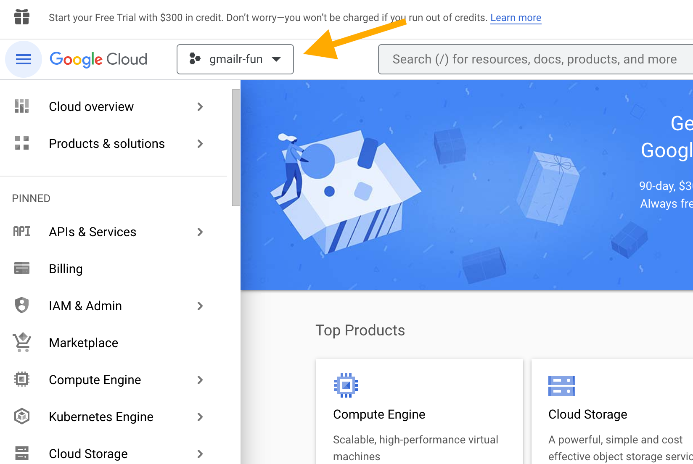
```

<!--
An existing Google Cloud user will land on a page similar to one of those shown here.
**The important thing is to confirm that the selected project (the project in which you want to create the OAuth client) is selected.**
The areas indicated by orange arrows are where you will see information about the currently selected project.

```{r}
#| echo: false
#| label: google-cloud-welcome-returning-user
#| out.width: 600px
#| fig-cap: >
#|   One possible "Welcome" screen (using the gargle project as an example).
#| fig-alt: >
#|   The "Welcome" screen for an existing user with access to the gargle
#|   project, which is reflected in various places on the page.
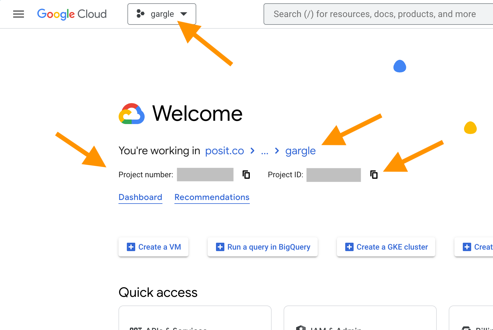
```

-->

## Enable the Gmail API

Now we need to configure APIs & Services for this project.
There are various ways to get to this, depending on where you start and the type of Google account.
Hopefully you can find your way to something like this:

<!--
```{r}
#| echo: false
#| label: apis-and-services-1
#| out.width: 600px
#| fig-cap: >
#|   caption
#| fig-alt: >
#|   alt
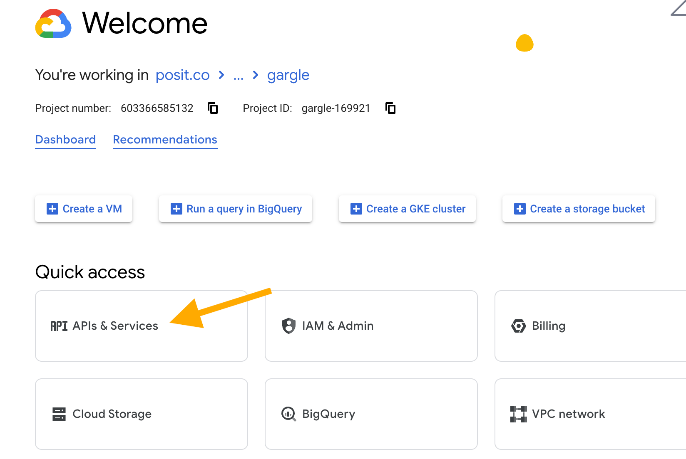
```
-->

```{r}
#| echo: false
#| label: apis-and-services-2
#| out.width: 600px
#| fig-cap: >
#|   caption
#| fig-alt: >
#|   alt
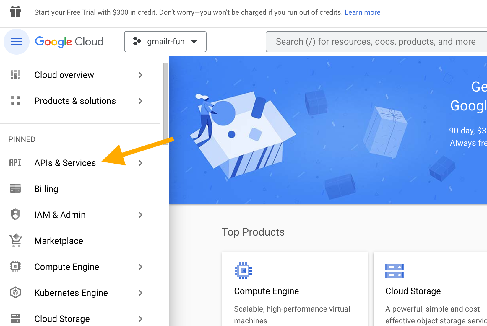
```

Click on "APIs & Services".

If the next screen reveals that the Gmail API is already enabled, you can move on.

However, here's how this screen might look for a new project that has no APIs enabled.

```{r}
#| echo: false
#| label: apis-and-services-3
#| out.width: 600px
#| fig-cap: >
#|   caption
#| fig-alt: >
#|   alt
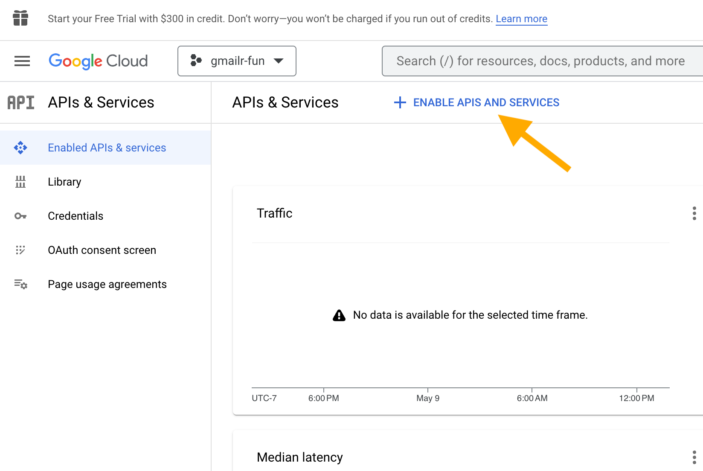
```

Click on "+ ENABLE APIS AND SERVICES".
In the next screen, search for the Gmail API and select it.
You will get to a screen like this:

```{r}
#| echo: false
#| label: enable-gmail-api
#| out.width: 600px
#| fig-cap: >
#|   caption
#| fig-alt: >
#|   alt
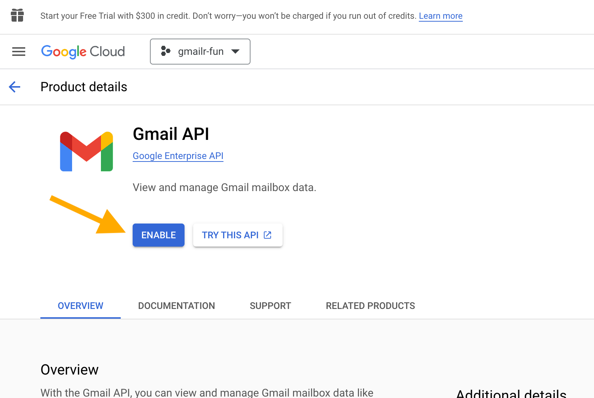
```

Click "ENABLE".

## Create an OAuth client

Now we will create an OAuth client.
Again, there are various ways to do this, depending on where you start and the type of Google account.
Here are some examples.

If you *just* enabled the Gmail API, you might see a button "CREATE CREDENTIALS", which you can click.

One way or another, we want to go to the "Credentials" section "APIs & Services".

```{r}
#| echo: false
#| label: go-to-credentials-1
#| out.width: 600px
#| fig-cap: >
#|   caption
#| fig-alt: >
#|   alt
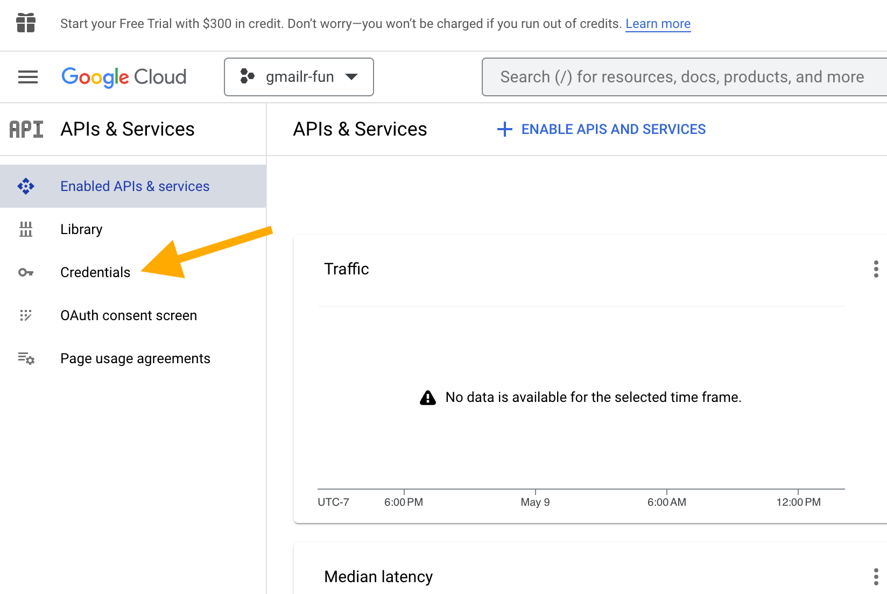
```

```{r}
#| echo: false
#| label: go-to-credentials-2
#| out.width: 600px
#| fig-cap: >
#|   caption
#| fig-alt: >
#|   alt
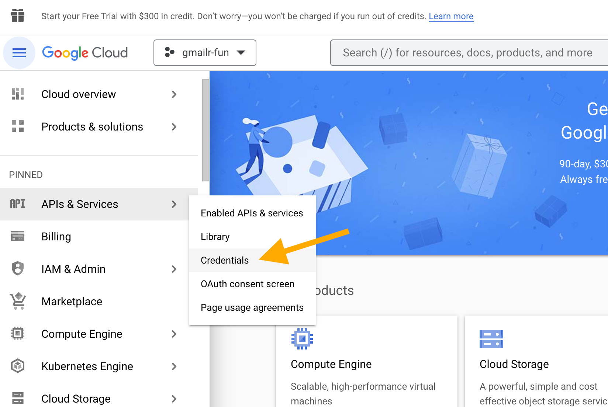
```

Here's how this screen will look for a new user and new project, i.e. where there are no credentials yet.

```{r}
#| echo: false
#| label: no-existing-credentials
#| out.width: 600px
#| fig-cap: >
#|   caption
#| fig-alt: >
#|   alt
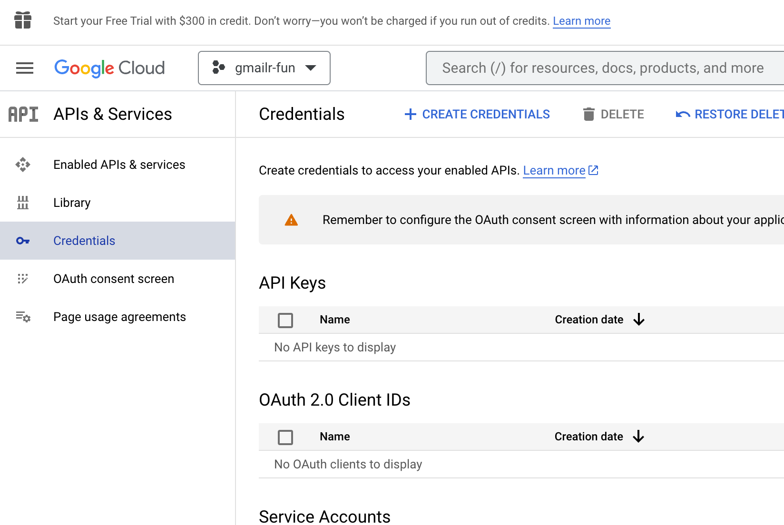
```

Here's how this screen might look in a project that has existed for a long time, that has many existing credentials of various types.

```{r}
#| echo: false
#| label: many-existing-credentials
#| out.width: 600px
#| fig-cap: >
#|   caption
#| fig-alt: >
#|   alt
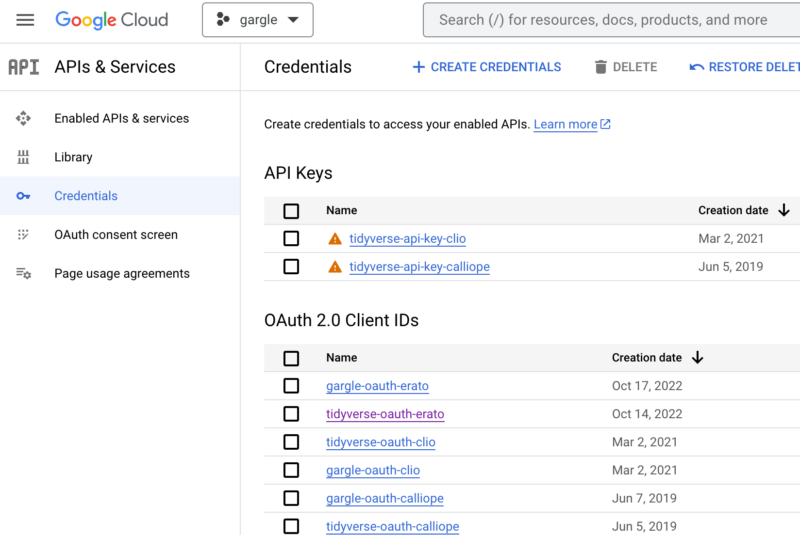
```

Now we create a new OAuth client.
Click on "+ CREATE CREDENTIALS".
Then select "OAuth client ID".

```{r}
#| echo: false
#| label: create-credentials-choices
#| out.width: 600px
#| fig-cap: >
#|   caption
#| fig-alt: >
#|   alt
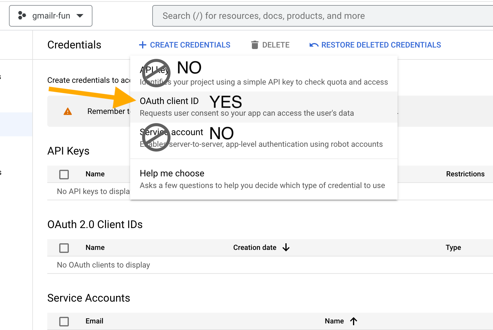
```

If you are working in a newly created project, you may need to configure your consent screen at this point.
Click on "CONFIGURE CONSENT SCREEN".

It is quite difficult to have an OAuth "app" that works for just anyone.
That is especially true in a project where the Gmail API is enabled.
There is an onerous registration and verification process.
This is why gmailr users have to create their own client, whereas other packages, like googlesheets4, can provide a built-in client to support casual users.
Therefore, this article describes how to proceed for someone who is creating an OAuth client essentially for personal use.
(This has substantial overlap with the process of creating an OAuth client for use within an Google Workspace organization.)

If you and your project are not part of a Google Workspace, you must choose the "External" user type.
This may seem weird, but since you are not part of an organization, there is no such thing as an internal user.
Select the "External" user type, then click "CREATE".

```{r}
#| echo: false
#| label: create-external-oauth-consent-screen
#| out.width: 600px
#| fig-cap: >
#|   caption
#| fig-alt: >
#|   alt
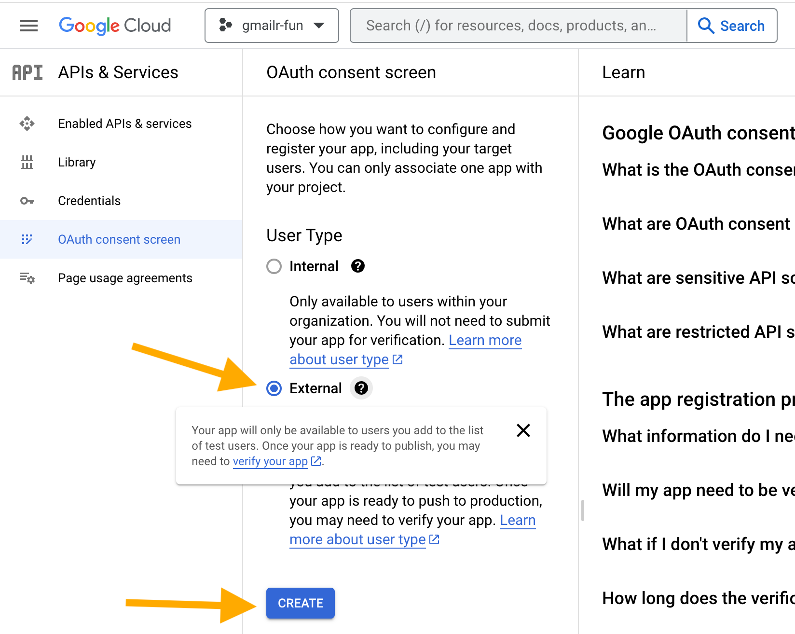
```

Now we edit the "app" information.
For "App name", a good default is to use the same label you used as the project name and project ID, e.g. "gmailr-fun".
A good default for "User support email" is whatever Google email address you are logged in with.

```{r}
#| echo: false
#| label: edit-app-registration-1
#| out.width: 600px
#| fig-cap: >
#|   caption
#| fig-alt: >
#|   alt
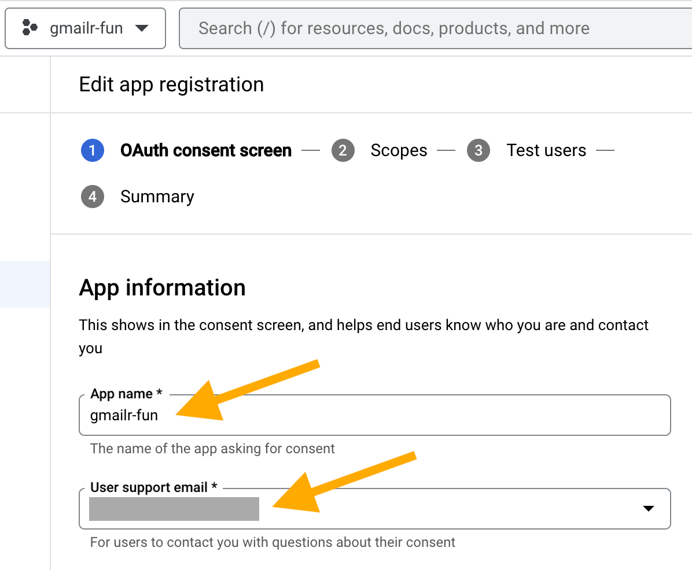
```

You can leave "App logo" and "App domain" unconfigured.
For the "Developer contact information", a good default is the same email as used for the "User support email", i.e. whatever Google email address you are logged in with.

```{r}
#| echo: false
#| label: edit-app-registration-2
#| out.width: 600px
#| fig-cap: >
#|   caption
#| fig-alt: >
#|   alt
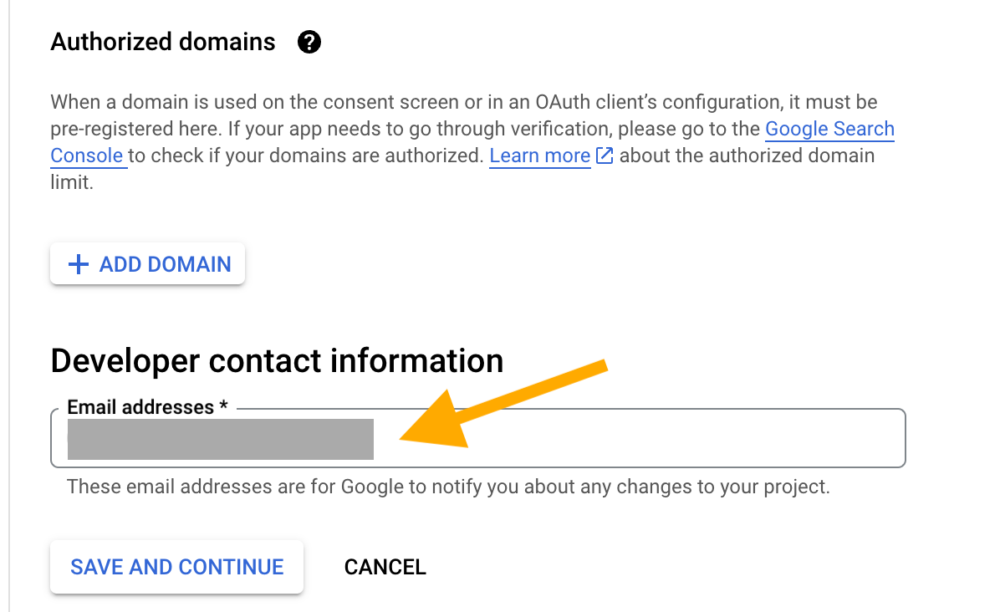
```

Click "SAVE AND CONTINUE".

Now we add scopes.
Click "ADD OR REMOVE SCOPES".

```{r}
#| echo: false
#| label: add-or-remove-scopes
#| out.width: 600px
#| fig-cap: >
#|   caption
#| fig-alt: >
#|   alt
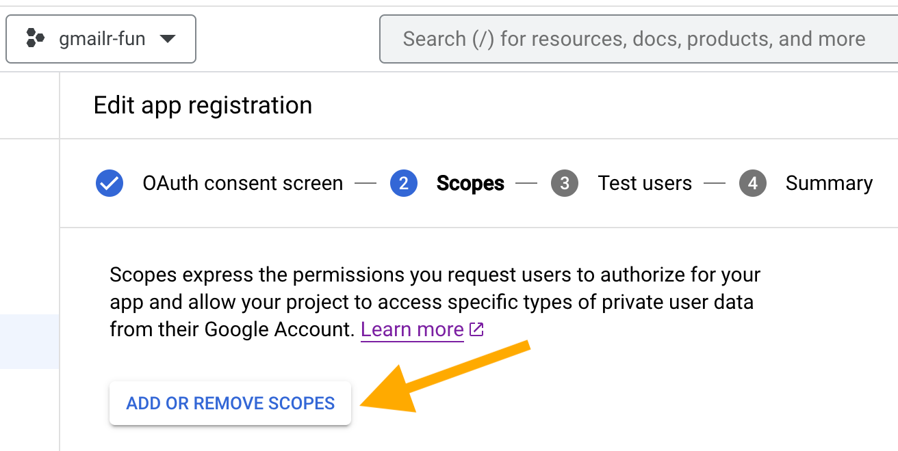
```

First, select the nonsensitive scopes:

* `".../auth/userinfo.email"`
* `".../auth/userinfo.profile"`
* `"openid"`

This makes it easier to tell which user is associated with an OAuth token downstream.
In particular, the gargle package always adds the `".../auth/userinfo.email"`, so you definitely want that enabled here.

```{r}
#| echo: false
#| label: nonsensitive-scopes
#| out.width: 600px
#| fig-cap: >
#|   caption
#| fig-alt: >
#|   alt
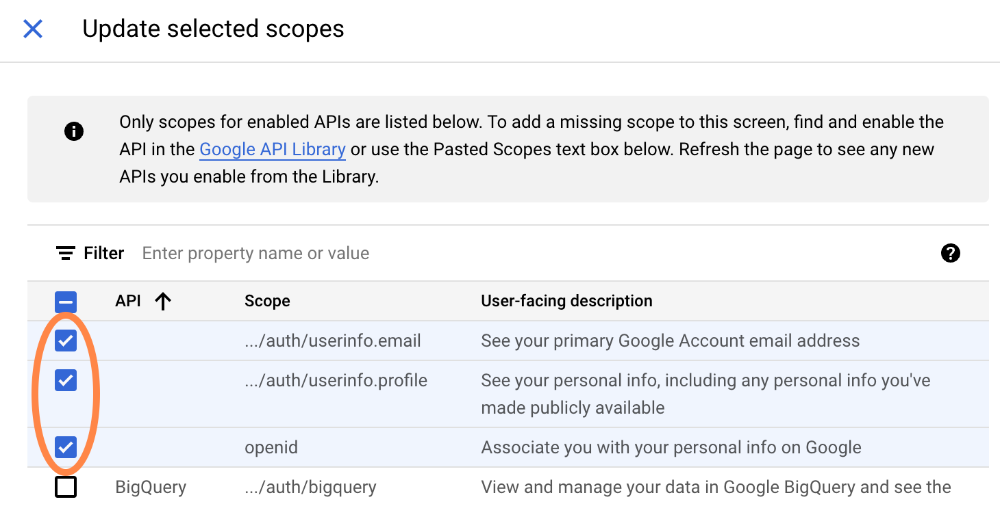
```

Then, use the "Filter" feature to find the scopes associated with the Gmail API.
You may want to adjust "Rows per page" to a number high enough to fit all the Gmail scopes on one page (at the time of writing, there are 14).
By default, I recommend selecting all Gmail scopes, for ease of downstream use.
You can always request a token with narrower scope with a call like `gm_auth(scopes = "gmail.readonly")`.
But if you don't select a scope here, that scope will never be available to you in `gm_auth()`.
If you have a specific reason to be conservative and you know you only plan to do "read only" work, then you can be extra careful and only enable specific scopes here.
When you're done selecting scopes, click "UPDATE".

```{r}
#| echo: false
#| label: filter-and-select-gmail-scopes
#| out.width: 600px
#| fig-cap: >
#|   caption
#| fig-alt: >
#|   alt
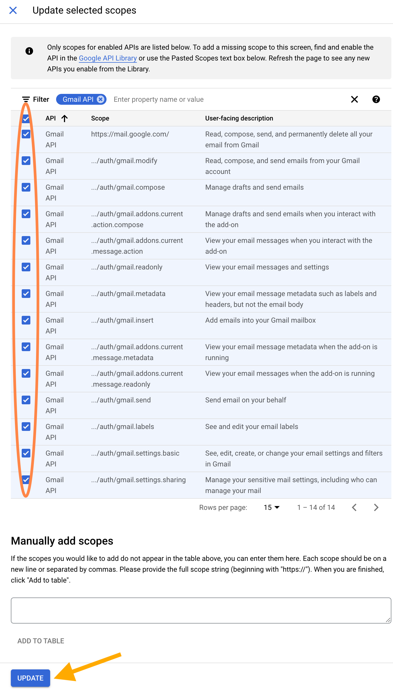
```

When you are returned to the "Edit app registration" screen, things look quite different, thanks to all the scopes you added.
It will look something like this:

```{r}
#| echo: false
#| label: edit-app-registration-3
#| out.width: 600px
#| fig-cap: >
#|   caption
#| fig-alt: >
#|   alt
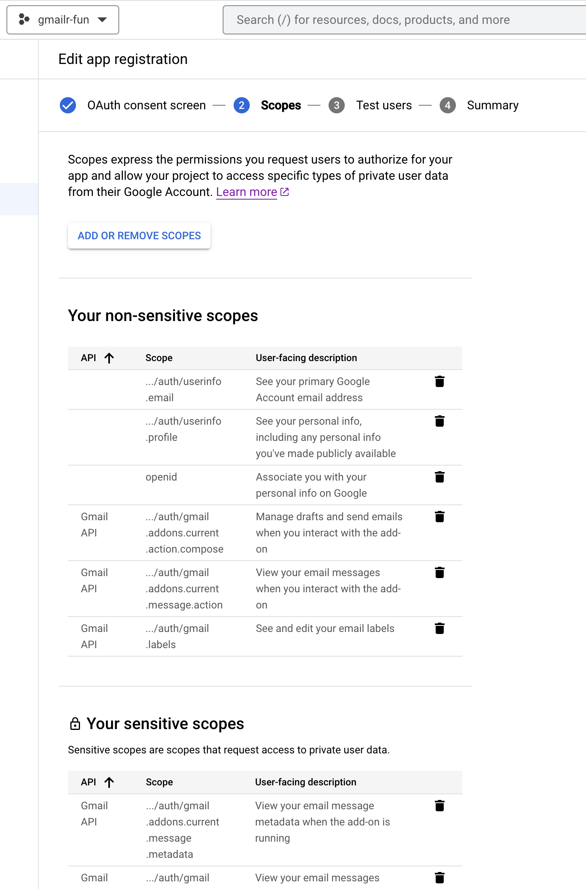
```

Scroll down to the bottom and click "SAVE AND CONTINUE".

```{r}
#| echo: false
#| label: edit-app-registration-4
#| out.width: 600px
#| fig-cap: >
#|   caption
#| fig-alt: >
#|   alt
knitr::include_graphics("img/edit-app-registration-4.png")
```

Now we will add a test user: YOU!
Click on "+ ADD USERS".

```{r}
#| echo: false
#| label: edit-app-registration-5
#| out.width: 600px
#| fig-cap: >
#|   caption
#| fig-alt: >
#|   alt
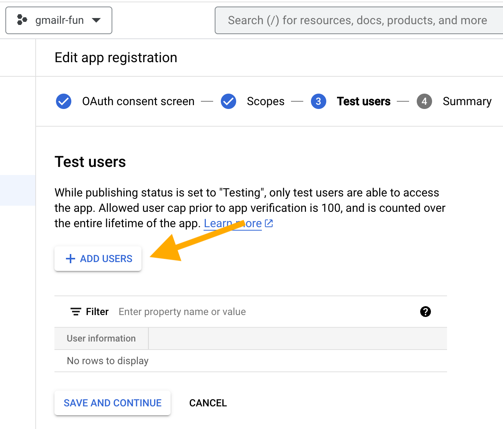
```

Enter your email address and click "ADD".

```{r}
#| echo: false
#| label: add-users
#| out.width: 600px
#| fig-cap: >
#|   caption
#| fig-alt: >
#|   alt
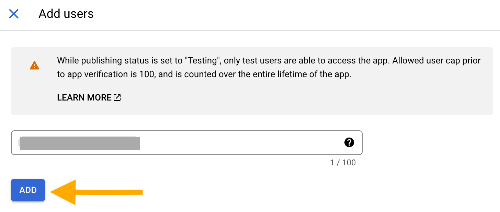
```

When you are returned to the "Edit app registration" screen, things look different, thanks to the test user you added.
It will look something like this:

```{r}
#| echo: false
#| label: edit-app-registration-6
#| out.width: 600px
#| fig-cap: >
#|   caption
#| fig-alt: >
#|   alt
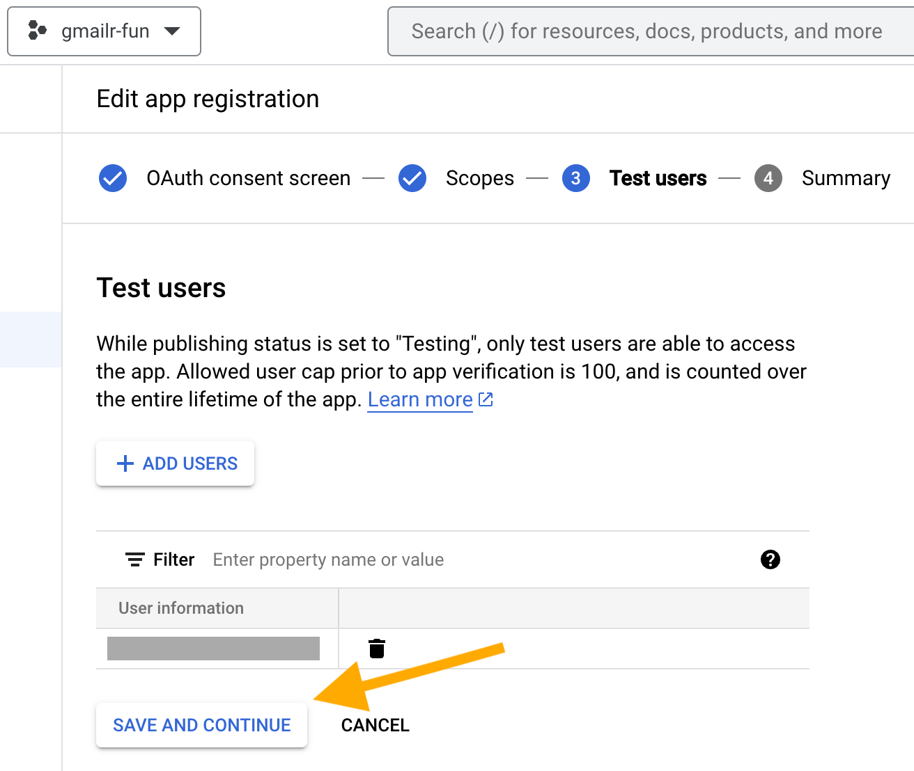
```

Click "SAVE AND CONTINUE".
Now you arrive at a "Summary" screen, that summarizes what you've entered for "OAuth consent screen", "Scopes", and "Test users".

Now we are truly ready to create the OAuth client.
Go to "Credentials" within "APIs & Services" and click "+ CREATE CREDENTIALS".

```{r}
#| echo: false
#| label: create-credentials-button
#| out.width: 600px
#| fig-cap: >
#|   caption
#| fig-alt: >
#|   alt
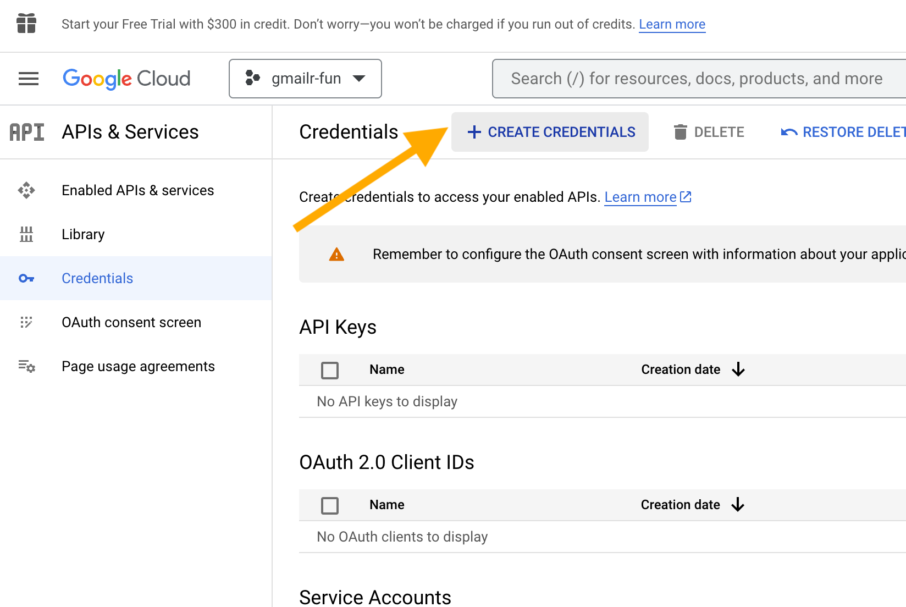
```

Select "OAuth client ID".

```{r}
#| echo: false
#| label: create-credentials-choices-2
#| out.width: 600px
#| fig-cap: >
#|   caption
#| fig-alt: >
#|   alt

```

Next you must choose "Application type".

```{r}
#| echo: false
#| label: oauth-client-type-choices
#| out.width: 600px
#| fig-cap: >
#|   caption
#| fig-alt: >
#|   alt
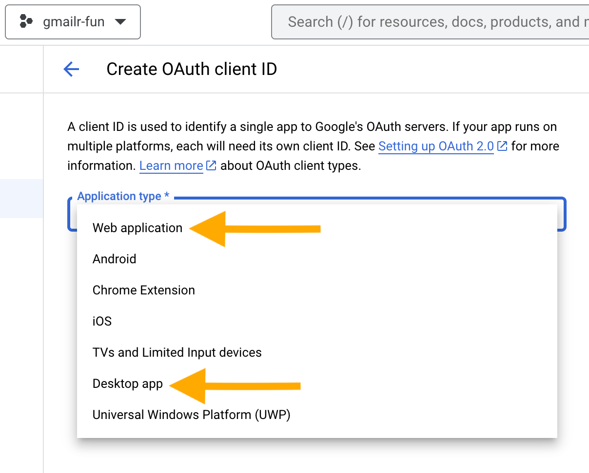
```

Here's how to decide:

* Desktop app: use this if you're going to use gmailr on your local computer.
  More technically, this is appropriate for any setting where the httpuv R
  package will be able to spin up a local web server (gargle does this behind
  the scenes for you).
* Web application: use this if you're going to use gmailr in some sort of hosted
  or cloud context. Examples include: RStudio Server, Posit Workbench, Posit
  Cloud, or Google Colaboratory. This is the client type needed for an
  "out-of-bound" (oob) auth flow or a gargle-specific variant known as
  pseudo-oob.
  
Let's say you choose "Desktop app".
Again, you'll get a chance to give the client a name.
I encourage you to give it a label that has some meaning and that you can hold in your head for minutes at a time.
Here I incorporate "desktop" to remind myself why type of client this is and "aardvark" is just a random animal.
If I need to add another client later (maybe of "Web application" type), I might call that one "web-baboon".
You get the idea.

```{r}
#| echo: false
#| label: oauth-client-create
#| out.width: 600px
#| fig-cap: >
#|   caption
#| fig-alt: >
#|   alt
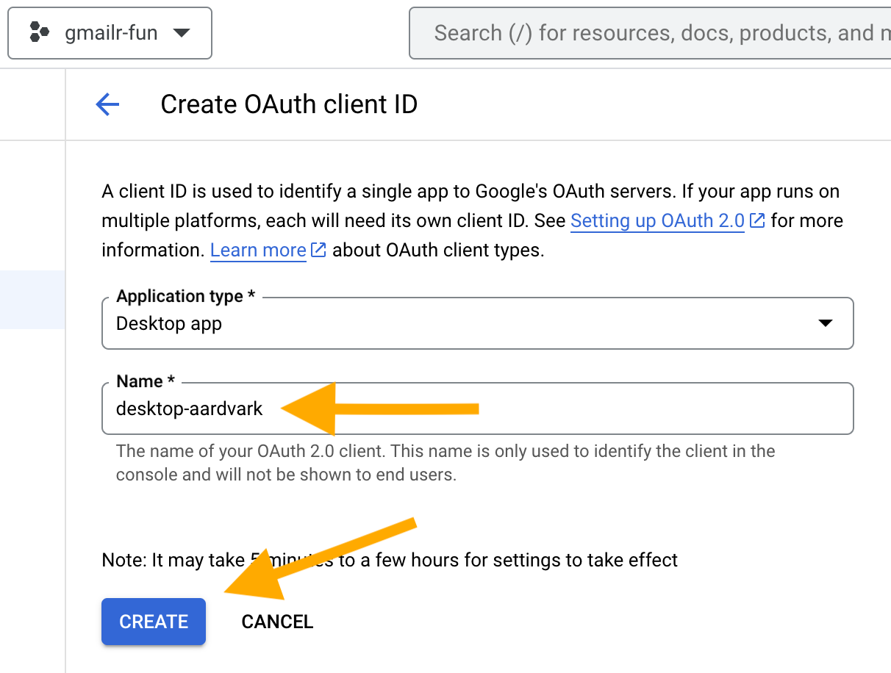
```

You should see the happy news that your OAuth client was created:

```{r}
#| echo: false
#| label: oauth-client-created-yay
#| out.width: 600px
#| fig-cap: >
#|   caption
#| fig-alt: >
#|   alt
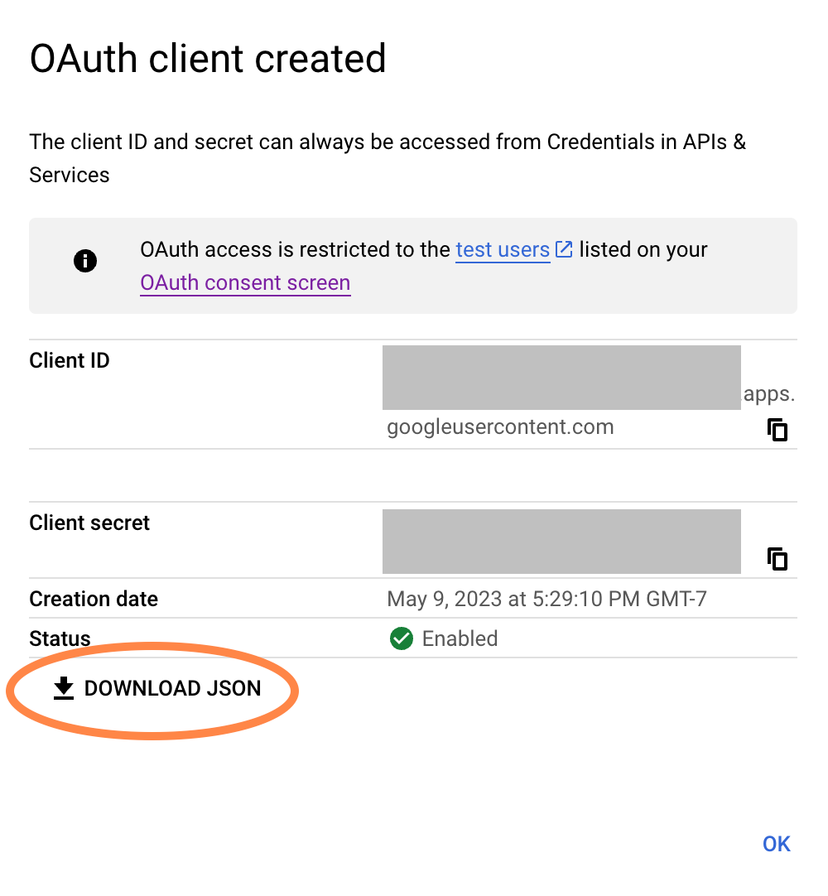
```

We want to "DOWNLOAD JSON", but rest assured that, as it says: "The client ID and secret can always be accessed from Credentials in APIs & Services" (including as downloadable JSON).
This is not one of those screens where you need to panic because you can never access this information again.

Click "DOWNLOAD JSON" and a `.json` file will be downloaded to wherever your browser is configured to put such things.
The filename will look like this (but longer and more random):

```
client_secret_8675309-nobody4overcome4nuanced.apps.googleusercontent.com
```

If you're still looking at the "OAuth client created pop-up", click "OK".
Now the "Credentials" screen within "APIs & Services" will look more like this:

```{r}
#| echo: false
#| label: one-existing-credential
#| out.width: 600px
#| fig-cap: >
#|   caption
#| fig-alt: >
#|   alt
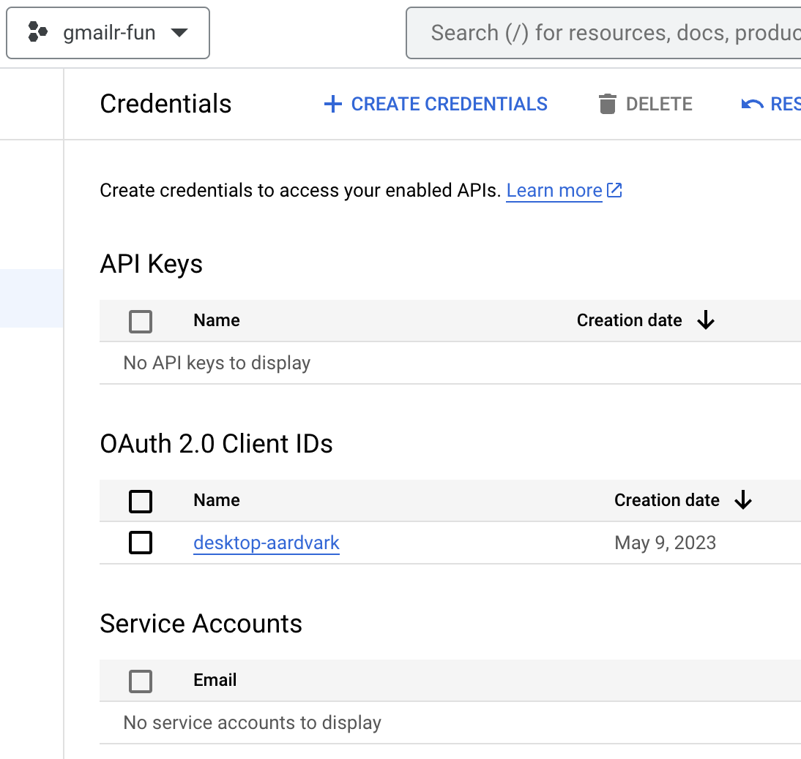
```

You should see your successfully created OAuth client ID, with the name you expect.

## Tell gmailr about your OAuth client

`gm_auth_configure()` is the function we use to tell gmailr about this OAuth client.
It is best to provide the filepath of the downloaded JSON to the `path` argument:

```{r}
#| eval: false
gm_auth_configure <- function(...,
                              path = gm_default_oauth_client(),
                              ...) { ... }
```

There are a couple of ways this can work.
You can provide the literal `path` in your R code.
This makes sense in some settings.
But most users should take advantage of the default value of `path`, which calls `gm_default_oauth_client()`.

`gm_default_oauth_client()` knows to look for the JSON in a few specific locations or environment variables.
Unless you have a reason to do otherwise, you might as well arrange for the OAuth client JSON to be discovered by `gm_default_oauth_client()`.
In order of preference:

1. Move the downloaded JSON file to the location returned by
   `rappdirs::user_data_dir("gmailr")`.
   That could look something like this:
   
    ```{r}
    #| eval: false
    path_old <- "~/Downloads/client_secret_123-abc.apps.googleusercontent.com.json"
    d <- fs::dir_create(rappdirs::user_data_dir("gmailr"), recurse = TRUE)
    fs::file_move(path_old, d)
    ```
    
   It's important that there only be one file whose name "looks" like
   a Google OAuth client ID file.
   
2. Move the downloaded JSON file to some other location of your
   choosing (or perhaps it's out of your control).
   Inform gmailr by recording the filepath in the
   `GMAILR_OAUTH_CLIENT` environment variable.
   In your `.Renviron`, you would have something like this:
   
   ```
   GMAILR_OAUTH_CLIENT=/path/to/my/gmailr/oauth-client.json
   ```

If you've successfully made your OAuth client automatically discoverable, you should be able to call `gm_auth_configure()` with no arguments, like this:

``` r
library(gmailr)

gm_auth_configure()

gm_oauth_client()
#> <gargle_oauth_client>
#> name: ...
#> id: ...
#> secret: <REDACTED>
#> type: installed
#> redirect_uris: ...
```

Then you should be able to "just use" gmailr, with or without an explicit call to `gm_auth()`.

Note that you will see some slightly scary screens when using your own personal OAuth client as one of the test users.
Once you do anything that triggers gmailr auth, you'll see this:

```{r}
#| echo: false
#| label: google-hasnt-verified-this-app
#| out.width: 600px
#| fig-cap: >
#|   caption
#| fig-alt: >
#|   alt
knitr::include_graphics("img/google-hasnt-verified-this-app.png")
```

Once you click "Continue", you'll need to say exactly what permissions you are willing to grant:

```{r}
#| echo: false
#| label: select-what-app-can-access
#| out.width: 600px
#| fig-cap: >
#|   caption
#| fig-alt: >
#|   alt
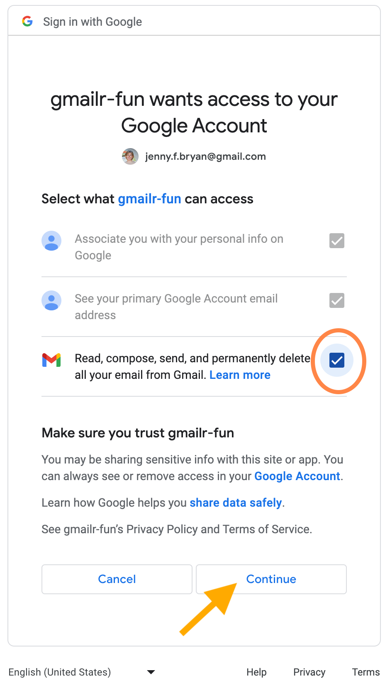
```

The pre-checked items reflect those nonsensitive scopes mentioned earlier.
But you still need to explicitly check the box for "Read, compose, send, and permanently delete all your email from Gmail".
Note that the exact wording and permissions of this last item may vary, if you specify non-default `scopes` in your `gm_auth()` call.
Click "Continue" to obtain a user token and, hopefully, live out your gmailr-powered dreams of controlling Gmail from R.
