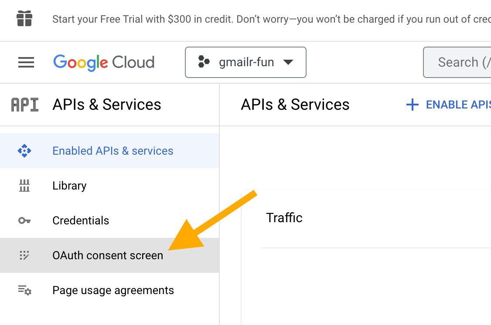
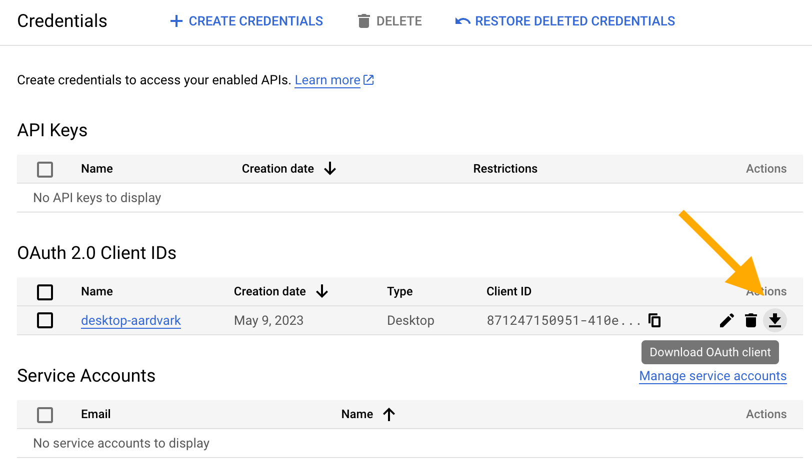
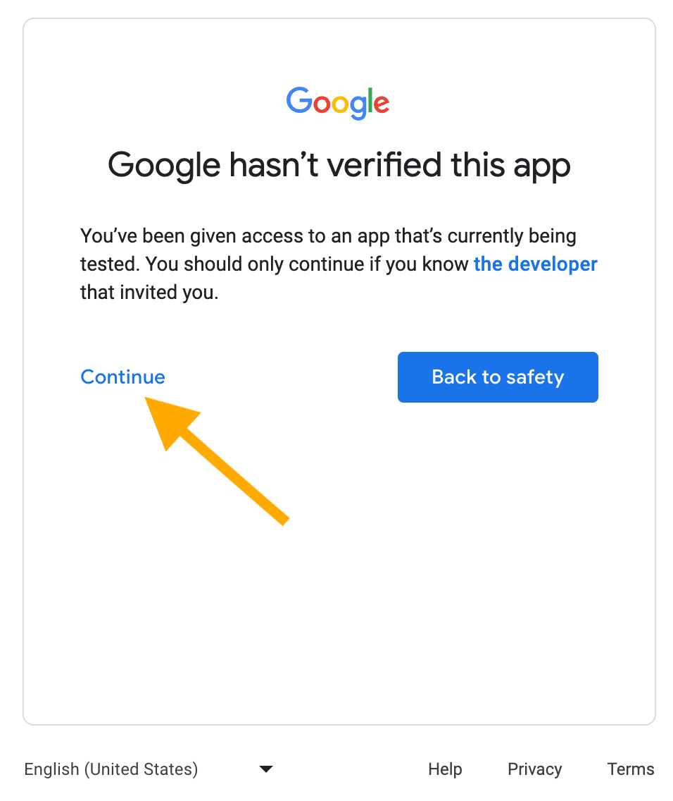

```{r, include = FALSE}
knitr::opts_chunk$set(
  collapse = TRUE,
  comment = "#>"
)
```

This article contains many screenshots, by necessity.
However, there are many downsides to a screenshot-heavy article and the reader needs to be ready to adapt to certain issues:

* These webpages are outside of the control of gmailr and change over
  time.
* These webpages can look different depending on:
  - The type of Google account you are using, i.e. an individual
    versus a user within a Google workspace organization, such as a
    company or university.
  - Your previous use of Google Cloud.
  - Probably other factors!

The bottom line is that the screenshots you see here may not exactly match what you see.
We offer this assistance on a "best effort" basis, but you may need to be a bit resourceful and resilient.
There may be differences between the screenshots here and what you see.

## Overview

This is a multi-step process and it's easy to get lost in the weeds, so here is an overiew of the main steps:

* Sign in to Google Cloud console
* Create a Google Cloud project
* Enable the Gmail API for the project
* Configure the OAuth consent screen for the project (or, using Google's
  vocabulary, for your "app")
* Create an OAuth client and download a JSON representation of it
* Tell gmailr about your OAuth client

## Sign in to Google Cloud console

*I focus on the user who has never used Google Cloud before and who is authenticating as an individual (versus as a user within an organization).
The rationale is that these are the users who will benefit the most from this detailed documentation.
I may eventually create documentation focused on a different type of user, but, in the meantime, hopefully other users can also gain something from this article.*

Go to the [Google Cloud console](https://cloud.google.com/cloud-console) and sign in:

<https://console.cloud.google.com/>

```{r}
#| echo: false
#| label: fig-sign-in
#| out.width: 600px
#| fig-alt: >
#|   The sign in page for Google Cloud Platform.
#|   The "Email or phone" box is selected and ready for user input.
#|   In the lower left is a "Next" button.
knitr::include_graphics("img/google-cloud-platform-sign-in.png")
```

Since this is your first usage of Google Cloud, you need to agree to their Terms of Service.

```{r}
#| echo: false
#| label: fig-welcome-new-user
#| out.width: 600px
#| fig-alt: >
#|   A screen with a checkbox to agree to the Google Cloud terms of service.

```

At this point, you might see an offer to start a free trial of Google Cloud Platform, but that is not necessary in order to create an OAuth client.
You might be interested in the free trial if you want to experiment with Google Cloud services that normally cost money, such as BigQuery or Maps.
You can activate the free trial, now, later or never; it has nothing to do with your ability to create an OAuth client that works with gmailr.

## Create a Google Cloud project

Next we need to select a project.
Locate and click the "Select a project" button.

```{r}
#| echo: false
#| label: fig-select-a-project-new-user-1
#| out.width: 600px
#| fig-alt: >
#|   Screenshot with an arrow pointing at the "Select a project" button, which
#|   is in the upper left, next to "Google Cloud".

```

Since you are a new user, presumably you don't have any existing projects.
Click "NEW PROJECT" in the upper right corner.

```{r}
#| echo: false
#| label: fig-select-a-project-new-user-2
#| out.width: 600px
#| fig-alt: >
#|   The "Select a project" with an arrow pointing to the "NEW PROJECT" button.

```

Now you are on the "New Project" screen.

```{r}
#| echo: false
#| label: new-project-new-user
#| out.width: 600px
#| fig-alt: >
#|   The "New Project" screen with a box where the user enters the Project name
#|   and a "CREATE" button. There are arrows pointing at this box, this button,
#|   and the Project ID.

```

I strongly recommend that you **do not** accept the automatically generated project name.
Instead I recommend that you give the project some meaningful (or at least memorable) label that reminds you of its purpose and use that for both the project name and project ID.
When you are happy with the project name and ID, click the "CREATE" button.
In this example, we are using "gmailr-fun" as the project name (and ID).

Now you should see that you are working within your intended target project.

```{r}
#| echo: false
#| label: fig-select-a-project-new-user-3
#| out.width: 600px
#| fig-alt: >
#|   The button that previously said "Select a project" for a new user now says
#|   "gmailr-fun", which is the name of the target project.

```

<!--
An existing Google Cloud user will land on a page similar to one of those shown here.
**The important thing is to confirm that the selected project (the project in which you want to create the OAuth client) is selected.**
The areas indicated by orange arrows are where you will see information about the currently selected project.

```{r}
#| echo: false
#| label: google-cloud-welcome-returning-user
#| out.width: 600px
#| fig-cap: >
#|   One possible "Welcome" screen (using the gargle project as an example).
#| fig-alt: >
#|   The "Welcome" screen for an existing user with access to the gargle
#|   project, which is reflected in various places on the page.

```

-->

## Enable the Gmail API for the project

Now we configure APIs & Services for this project.
There are various ways to get to this screen, depending on where you start and the type of Google account.
Hopefully you can find your way to something like this:

<!--
```{r}
#| echo: false
#| label: apis-and-services-1
#| out.width: 600px
#| fig-cap: >
#|   caption
#| fig-alt: >
#|   alt

```
-->

```{r}
#| echo: false
#| label: apis-and-services-2
#| out.width: 600px
#| fig-alt: >
#|   Screenshot with an arrow pointing at "APIs & Services" in a left sidebar.

```

Click on "APIs & Services".
If the next screen reveals that the Gmail API is already enabled, you can move on.
However, here's how this screen might look for a new project that has no APIs enabled:

```{r}
#| echo: false
#| label: apis-and-services-3
#| out.width: 600px
#| fig-alt: >
#|   Screenshot with an arrows pointing at the "+ ENABLE APIS AND SERVICES"
#|   button.

```

Click on "+ ENABLE APIS AND SERVICES".
In the next screen, search for the Gmail API and select it.
You will get to a screen like this:

```{r}
#| echo: false
#| label: enable-gmail-api
#| out.width: 600px
#| fig-alt: >
#|   Screen for the Gmail API with an arrow pointing at the "ENABLE" button.

```

Click "ENABLE".

## Configure the OAuth consent screen

This step may feel unexpected, because you may not be very sure what the "OAuth consent screen" even is.
It can help to connect your goals with how Google frames this task.
Google's vocabulary in this step frequently refers to your *application* or your *app*.
You can basically think of your Google Cloud project as what Google means by your app or application.
And that project/app basically refers to "the work I plan to do with the Gmail API from R".

It's time to go to "OAuth consent screen", which is one of the pages you can access from APIs & Services.
Click on "OAuth consent screen".

```{r}
#| echo: false
#| label: oauth-consent-screen
#| out.width: 600px
#| fig-alt: >
#|   Screenshot with an arrow pointing at "OAuth consent screen" within
#|   "APIs & Services" in a left sidebar.

```

It is quite difficult to have an OAuth "app" that works for just anyone.
There is an onerous registration and verification process.
The tidyverse team has done this for the Drive, Sheets, and BigQuery APIs, which makes auth easier for casual R use with the googledrive, googlesheets4, and bigrquery packages.
But it is essentially impossible to do the same for a project that has the Gmail API enabled.
This is why gmailr users have to create their own OAuth client.
Users of googledrive, googlesheets4, and bigrquery packages may elect to use their own OAuth client, obtained with the same process described here, except with different APIs enabled for the project.

Since you and your project are not part of a Google Workspace, you must choose the "External" user type.
This may seem weird, but since you are not part of an organization, there is no such thing as an internal user.
Select the "External" user type, then click "CREATE".

```{r}
#| echo: false
#| label: create-external-oauth-consent-screen
#| out.width: 600px
#| fig-alt: >
#|   Screenshot with an arrow pointing at a filled radio button indicating the
#|   "External" user type and an arrow pointing at the "CREATE" button.

```

(This article focuses on the solo user who is in not part of Google Workspace, but the process has substantial overlap with creating an OAuth client for use within an Google Workspace organization.
In that context, the "Internal" user type should be available and is probably the best choice.)

Now we edit the "App information".
For "App name", a good default is to use the same label you used as the project name and project ID, e.g. "gmailr-fun".
A good default for "User support email" is whatever Google email address you are logged in with.

```{r}
#| echo: false
#| label: edit-app-registration-1
#| out.width: 600px
#| fig-alt: >
#|   Screenshot with arrows pointing at the boxes where a user enters "App name"
#|   and "User support email".

```

You can leave "App logo" and "App domain" unconfigured.
For the "Developer contact information", a good default is whatever Google email address you are logged in with, which we also used for the "User support email".
All of this setup and terminology makes more sense for those who really are creating an application for multiple users.
It's weird for the solo user, but it is what it is.

```{r}
#| echo: false
#| label: edit-app-registration-2
#| out.width: 600px
#| fig-alt: >
#|   Screenshot with an arrow pointing at the box where a user enters an email
#|   address as "Developer contact information".

```

Click "SAVE AND CONTINUE".

Now we add scopes.
Click "ADD OR REMOVE SCOPES".

```{r}
#| echo: false
#| label: add-or-remove-scopes
#| out.width: 600px
#| fig-alt: >
#|   Screenshot with an arrow pointing at the "ADD OR REMOVE SCOPES" button.

```

First, select these (nonsensitive) scopes:

* `".../auth/userinfo.email"`
* `".../auth/userinfo.profile"`
* `"openid"`

This makes it easier to tell which user is associated with an OAuth token downstream.
In particular, the gargle package always adds the `".../auth/userinfo.email"` scope when obtaining user tokens, so you definitely want that enabled here.

```{r}
#| echo: false
#| label: nonsensitive-scopes
#| out.width: 600px
#| fig-alt: >
#|   Screenshot showing three checked checkboxes for 3 scopes.

```

Then, use the "Filter" feature to find the scopes associated with the Gmail API.
You may want to adjust "Rows per page" to a number high enough to fit all the Gmail scopes on one page (at the time of writing, there are 14).
By default, I recommend selecting all Gmail scopes, for ease of downstream use.
You can always request a token with narrower scope with a call like `gm_auth(scopes = "gmail.readonly")`.
But if you don't select a scope here, that scope will never be available to you in `gm_auth()`.
If you have a specific reason to be conservative and you know you only plan to do "read only" work, then you can be extra careful and only enable specific scopes here.
When you're done selecting scopes, click "UPDATE".

```{r}
#| echo: false
#| label: filter-and-select-gmail-scopes
#| out.width: 600px
#| fig-alt: >
#|   Screenshot showing many checked checkboxes for the Gmail API scopes.

```

When you are returned to the "Edit app registration" screen, things look quite different, thanks to all the scopes you added.
It will look something like this:

```{r}
#| echo: false
#| label: edit-app-registration-3
#| out.width: 600px
#| fig-alt: >
#|   Screenshot of the Scopes page listing the many scopes are now added to the
#|   app.

```

Scroll down to the bottom and click "SAVE AND CONTINUE".

```{r}
#| echo: false
#| label: edit-app-registration-4
#| out.width: 600px
#| fig-alt: >
#|   Screenshot with an arrow pointing at the "SAVE AND CONTINUE" button.
knitr::include_graphics("img/edit-app-registration-4.png")
```

Now we will add a test user: YOU!
Click on "+ ADD USERS".

```{r}
#| echo: false
#| label: edit-app-registration-5
#| out.width: 600px
#| fig-alt: >
#|   Screenshot with an arrow pointing at the "+ ADD USERS" button.

```

Enter your email address and click "ADD".

```{r}
#| echo: false
#| label: add-users
#| out.width: 600px
#| fig-alt: >
#|   Screenshot of the "Add users" screen with a box where the user has
#|   entered their email address, which is obscured by an opaque rectangle.
#|   There is an arrow pointing at the "ADD" button.

```

When you are returned to the "Edit app registration" screen, things look different, thanks to the test user you added.
It will look something like this:

```{r}
#| echo: false
#| label: edit-app-registration-6
#| out.width: 600px
#| fig-alt: >
#|   Screenshot that shows 1 user under "User information", where the email
#|   address is obscured by an opaque rectangle. THere is an arrow pointing at
#|   the "SAVE AND CONTINUE" button.

```

Click "SAVE AND CONTINUE".
Now you arrive at a "Summary" screen, that summarizes what you've entered for "OAuth consent screen", "Scopes", and "Test users".

## Create an OAuth client

Now we go to the "Credentials" section of "APIs & Services".
You can get there in various ways, depending on where you start.

```{r}
#| echo: false
#| label: go-to-credentials-1
#| out.width: 600px
#| fig-alt: >
#|   Screenshot with an arrow pointing at "Credentials" below "APIs & Services"
#|   in a left sidebar.

```

```{r}
#| echo: false
#| label: go-to-credentials-2
#| out.width: 600px
#| fig-alt: >
#|   Screenshot with an arrow pointing at "Credentials" in a menu accessed by
#|   clicking on "APIs & Services" in a left sidebar.

```

Here's how this screen will look for a new user and new project, i.e. where there are no credentials yet.

```{r}
#| echo: false
#| label: no-existing-credentials
#| out.width: 600px
#| fig-alt: >
#|   Screenshot of the "Credentials" page when there are no existing
#|   credentials.

```

Here's how this screen might look in a project that has existed for a long time, that has many existing credentials of various types.

```{r}
#| echo: false
#| label: many-existing-credentials
#| out.width: 600px
#| fig-alt: >
#|   Screenshot of the "Credentials" page showing existing credentials, e.g. a
#|   couple of API keys and several OAuth 2.0 Client IDs.

```

Now we create a new OAuth client.
Click on "+ CREATE CREDENTIALS".

```{r}
#| echo: false
#| label: create-credentials-button
#| out.width: 600px
#| fig-alt: >
#|   Screenshot with an arrow pointing at the "+ CREATE CREDENTIALS" button.

```

Select "OAuth client ID".

```{r}
#| echo: false
#| label: create-credentials-choices
#| out.width: 600px
#| fig-alt: >
#|   Screenshot of the choices presented when creating new credentials. There is
#|   an arrow pointing at "OAuth client ID" which is the correct choice, along
#|   with the text "YES". Two other choices, "API key" and "Service account",
#|   are marked with the text "NO".

```

Next you must choose "Application type".

```{r}
#| echo: false
#| label: oauth-client-type-choices
#| out.width: 600px
#| fig-alt: >
#|   Screenshot of the "Application type" dropdown menu with arrows pointing at
#|   two of the choices, "Web application" and "Desktop app".

```

Here's how to choose the application type:

* Desktop app: use this if you're going to use gmailr on your local computer.
  More technically, this is appropriate for any setting where the httpuv R
  package will be able to spin up a local web server (gargle does this behind
  the scenes for you).
* Web application: use this if you're going to use gmailr in some sort of hosted
  or cloud context. Examples include: RStudio Server, Posit Workbench, Posit
  Cloud, or Google Colaboratory. This is the client type needed for an
  "out-of-bound" (oob) auth flow or a gargle-specific variant known as
  pseudo-oob.
  
Let's say you choose "Desktop app".
Again, you'll get a chance to give the client a name.
I encourage you to give it a label that has some meaning and that you can hold in your head for minutes at a time.
In this example, I use the name "desktop-aardvark".
I incorporate "desktop" to remind myself which type of client this is and "aardvark" is just a random animal.
If I need to add another client later (maybe of "Web application" type), I might call that one "web-baboon".
You get the idea.

```{r}
#| echo: false
#| label: oauth-client-create
#| out.width: 600px
#| fig-alt: >
#|   Screenshot of the "Create OAuth client ID" screen with "Desktop app"
#|   selected as the Application type and "desktop-aardvark" filled in the
#|   "Name" box. There are arrows pointing at the "Name" box and the "CREATE"
#|   button.

```

You should see the happy news that your OAuth client was created:

```{r}
#| echo: false
#| label: oauth-client-created-yay
#| out.width: 600px
#| fig-alt: >
#|   Screenshot of the "OAuth client created" pop-up, with a large oval
#|   highlighting the "DOWNLOAD JSON" button.

```

We want to "DOWNLOAD JSON", but rest assured that, as it says: "The client ID and secret can always be accessed from Credentials in APIs & Services" (including as downloadable JSON).
This is not one of those screens where you need to panic because you can never access this information again.

Click "DOWNLOAD JSON" and a `.json` file will be downloaded to wherever your browser is configured to put such things.
The filename will look like this (but longer and more random):

```
client_secret_8675309-nobody4overcome4nuanced.apps.googleusercontent.com
```

If you're still looking at the "OAuth client created" pop-up, click "OK".
Now the "Credentials" screen within "APIs & Services" will look more like this:

```{r}
#| echo: false
#| label: one-existing-credential
#| out.width: 600px
#| fig-alt: >
#|   Screenshot of the "Credentials" screen showing 1 existing OAuth 2.0 Client
#|   ID named "desktop-aardvark".

```

You should see your successfully created OAuth client ID, with the name you gave it.

If you ever need to access to this JSON again, come back to the "Credentials" screen and there is a download button for all existing OAuth client IDs.

```{r}
#| echo: false
#| label: oauth-client-post-hoc-download
#| out.width: 600px
#| fig-alt: >
#|   Screenshot of the "Credentials" screen with an arrow pointing at a
#|   "download" icon in the table row associated with the existing OAuth 2.0
#|    Client ID named "desktop-aardvark".

```

## Tell gmailr about your OAuth client

`gm_auth_configure()` is the function we use to tell gmailr about this OAuth client.
It is best to provide the filepath of the downloaded JSON to the `path` argument:

```{r}
#| eval: false
gm_auth_configure <- function(...,
                              path = gm_default_oauth_client(),
                              ...) { ... }
```

There are a couple of ways this can work.
You can provide an actual `path` in your R code.
This makes sense in some settings.
But most users should take advantage of the default value of `path`, which calls `gm_default_oauth_client()`.

`gm_default_oauth_client()` knows to look for the JSON in a few specific locations or environment variables.
Unless you have a reason to do otherwise, you might as well arrange for the OAuth client JSON to be discovered by `gm_default_oauth_client()`.
In order of preference:

1. Move the downloaded JSON file to the location returned by
   `rappdirs::user_data_dir("gmailr")`.
   You could accomplish this move with code like this:
   
    ```{r}
    #| eval: false
    path_old <- "~/Downloads/client_secret_123-abc.apps.googleusercontent.com.json"
    d <- fs::dir_create(rappdirs::user_data_dir("gmailr"), recurse = TRUE)
    fs::file_move(path_old, d)
    ```
    
   It's important that the target folder only has one file whose name "looks"
   like a Google OAuth client file.
   
2. Place the downloaded JSON file in some other location (perhaps this is out of
   your control).
   Inform gmailr by recording this filepath in the `GMAILR_OAUTH_CLIENT` 
   environment variable.
   In your `.Renviron`, you would have something like this:
   
   ```
   GMAILR_OAUTH_CLIENT=/path/to/my/gmailr/oauth-client.json
   ```

If you've successfully made your OAuth client automatically discoverable, you should be able to call `gm_auth_configure()` with no arguments, like this, and then immediately use `gm_oauth_client()` to confirm that a client has been configured:

``` r
library(gmailr)

gm_auth_configure()

gm_oauth_client()
#> <gargle_oauth_client>
#> name: ...
#> id: ...
#> secret: <REDACTED>
#> type: installed
#> redirect_uris: ...
```

Then you should be able to "just use" gmailr, with or without an explicit call to `gm_auth()`.

Note that you will see some slightly scary screens when using your own personal OAuth client as one of the test users.
Once you do anything that triggers gmailr auth, you'll see this:

```{r}
#| echo: false
#| label: google-hasnt-verified-this-app
#| out.width: 600px
#| fig-alt: >
#|   Screenshot that reads: "Google hasn't verified this app. You've been given
#|   access to an app that's currently being tested. You should only continue
#|   if you know the developer that invited you." There is an arrow pointing
#|   at the word "Continue". There is also a button labelled as "Back to
#|   safety".

```

Once you click "Continue", you'll need to say exactly what permissions you are willing to grant:

```{r}
#| echo: false
#| label: select-what-app-can-access
#| out.width: 600px
#| fig-alt: >
#|   Screenshot that reads: "gmailr-fun wants access to your Google Account".
#|   Then it shows the email "jenny.f.bryan@gmail.com".
#|   Next the text "Select what gmailr-fun can access".
#|   The choice "Associate you with your personal info on Google" is preselected
#|   and greyed out, indicating this choice cannot be altered.
#|   The choice "See your primary Google Account email address" is preselected
#|   and greyed out, indicating this choice cannot be altered.
#|   The choice "Read, compose, send, and permanently delete all your email from
#|   Gmail" has been checked. This is emphasized with an orange oval.
#|   Then there is text: "Make sure you trust gmailr-fun. You may be sharing
#|   sensitive info with this site or app. You can always see or remove access
#|   in your Google Account.
#|   There is an arrow pointing at the "Continue" button at the bottom of the
#|   page.

```

The pre-checked items reflect those nonsensitive scopes mentioned earlier.
But you still need to explicitly check the box for "Read, compose, send, and permanently delete all your email from Gmail".
Note that the exact wording and permissions of this last item may vary, if you specify non-default `scopes` in your `gm_auth()` call.
Click "Continue" to obtain a user token and, hopefully, live out your gmailr-powered dreams of controlling Gmail from R.
